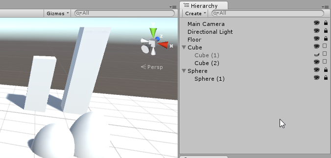
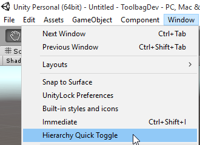

Hierarchy Quick Toggle
===

Hierarchy Quick Toggle adds icons in the Hierarchy view to quickly hide or lock objects in the scene, similar to Photoshop's layer view.

Usage
---
Place the QuickToggle folder in your project. The toggles can be turned on and off by going to `Window>Hierarchy Quick Toggle`

