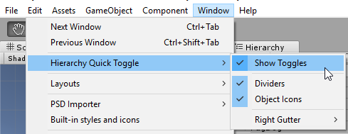

# Hierarchy Quick Toggle

Hierarchy Quick Toggle adds icons in the Hierarchy view to quickly hide or lock objects in the scene, similar to Photoshop's layer view.

## Installation

Get the latest UnityPackage from [GitHub releases](https://github.com/SubjectNerd-Unity/QuickToggle/releases). The `QuickToggle` directory can be moved to another directory after importing.

## Usage

The toggles can be turned on and off by going to `Window>Hierarchy Quick Toggle>Show Toggles`

### Options

**Dividers** — A horizontal line is drawn between each hierarchy item.

**Object Icons** — If an [icon is assigned to an object](https://docs.unity3d.com/Manual/AssigningIcons.html), draw the icon in the hierarchy.

**Right Gutter** — If other plugins draw on the right of the hierarchy window, use this setting to add spacing.

## Buy me a coffee!

If this useful to you, it would be great if you could [buy me a coffee](https://ko-fi.com/subjectnerd)!
